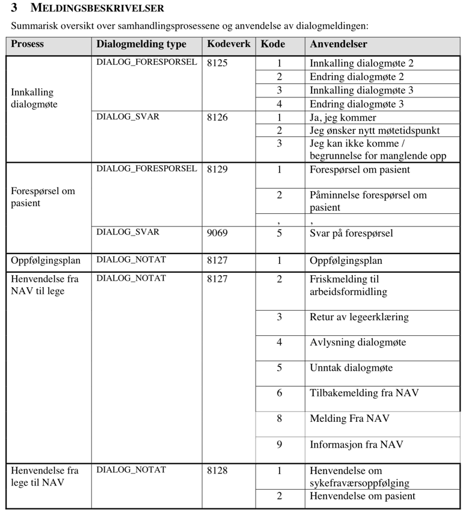

# helsemelding-message-converter

Library for converting helsemelding dialog messages between MsgHead XML and the JSON message models from `json-schema-core`.

The library currently supports two conversion directions:

- Incoming dialog message: MsgHead XML to `IncomingDialogMessage` JSON
- Outgoing dialog message: `OutgoingDialogMessage` JSON to MsgHead XML

It also includes helpers for extracting and removing attachments from MsgHead XML.

## Public API

Use `MsgHeadMessageConverter` for MsgHead-based conversions:

```kotlin
import no.nav.helsemelding.message.converter.MsgHeadMessageConverter

val converter = MsgHeadMessageConverter()
```

The converter implements:

```kotlin
interface MessageConverter {
    fun incomingDialogMessageXmlToJson(xml: String): Either<ConversionError, String>
    fun outgoingDialogMessageJsonToXml(json: String): Either<ConversionError, String>
}
```

It also implements `AttachmentHandler`:

```kotlin
interface AttachmentHandler {
    fun splitAttachments(msgHeadXml: String): Either<ConversionError, SplitMessage>
    fun extractAttachments(msgHeadXml: String): Either<ConversionError, List<Attachment>>
    fun removeAttachments(msgHeadXml: String): Either<ConversionError, String>
}
```

## Convert Incoming MsgHead XML To JSON

```kotlin
import arrow.core.getOrElse
import no.nav.helsemelding.message.converter.MsgHeadMessageConverter

val converter = MsgHeadMessageConverter()

val json = converter
    .incomingDialogMessageXmlToJson(msgHeadXml)
    .getOrElse { error ->
        error("Could not convert incoming dialog message: ${error.message}")
    }
```

The resulting JSON follows the `IncomingDialogMessage` schema from `json-schema-core`.

## Convert Outgoing JSON To MsgHead XML

```kotlin
import arrow.core.getOrElse
import no.nav.helsemelding.message.converter.MsgHeadMessageConverter

val converter = MsgHeadMessageConverter()

val xml = converter
    .outgoingDialogMessageJsonToXml(outgoingDialogMessageJson)
    .getOrElse { error ->
        error("Could not convert outgoing dialog message: ${error.message}")
    }
```

The input JSON must follow the `OutgoingDialogMessage` schema from `json-schema-core`.

### Types of outgoing dialog message

All outgoing messages are based on `OutgoingDialogMessage`, however some information is not used depending on 
`OutgoingDialogMessageType`.

#### FollowUpPlanMessage

- Provided `ConversationReference` is ignored and not included in the created message
- Requires an attachment 
- Provided message text is ignored and replaced with hardcoded value in the created message

#### InquiryMessage and MemoMessage

- ConversationReference is used if provided 
- If no `conversationReference` is provided then the provided message id is used as `parentMessageId` and `conversationId` 
because this will be considered the first message in the conversation.

### Resources

The implementation is based on the specification in the following PDF: `Veiledning til anvendelse av dialogmelding for 2-veis 
kommunikasjon mellom NAV og samhandlere i helsesektoren` found on the page [Forespørsel om pasient](https://www.helsedirektoratet.no/standarder/foresporsel-om-pasient).
It also makes use of code generated based on XSD from [syfo-xml-codegen](https://github.com/navikt/syfo-xml-codegen) to 
easier create the desired XML.

A list of supported outgoing and incoming dialog messages (from specification) can be found in the table below:


Complete examples of every possible outgoing message can be found in the [test folder](./src/test/resources/msghead)

## Attachments

Attachments can be handled separately from conversion:

```kotlin
val splitMessage = converter.splitAttachments(msgHeadXml)
val attachments = converter.extractAttachments(msgHeadXml)
val xmlWithoutAttachments = converter.removeAttachments(msgHeadXml)
```

`splitAttachments` returns the XML with attachments removed and the extracted attachments in one operation:

```kotlin
data class SplitMessage(
    val messageWithoutAttachmentsXml: String,
    val attachments: List<Attachment>
)
```

`Attachment` contains:

```kotlin
data class Attachment(
    val description: String,
    val contentType: String,
    val contentBase64: String
)
```

Supported attachment MIME types are PDF, TIFF, PNG, JPEG, PJPEG, JPG, and PJPG.

## Errors

All public operations return `Either<ConversionError, T>`.

Possible error types:

- `InvalidXml`
- `InvalidJson`
- `MappingError`
- `SerializationError`
- `AttachmentError`
- `AttachmentMissingError`
- `AdditionalMessageInfoError`

Example:

```kotlin
converter.incomingDialogMessageXmlToJson(msgHeadXml).fold(
    { error -> println("Conversion failed: ${error.message}") },
    { json -> println(json) }
)
```
